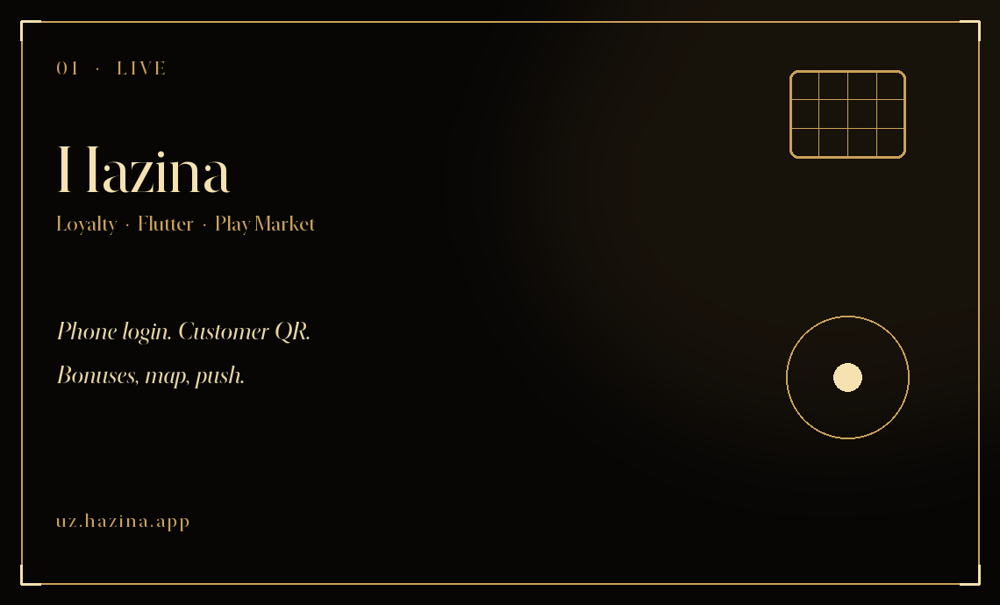
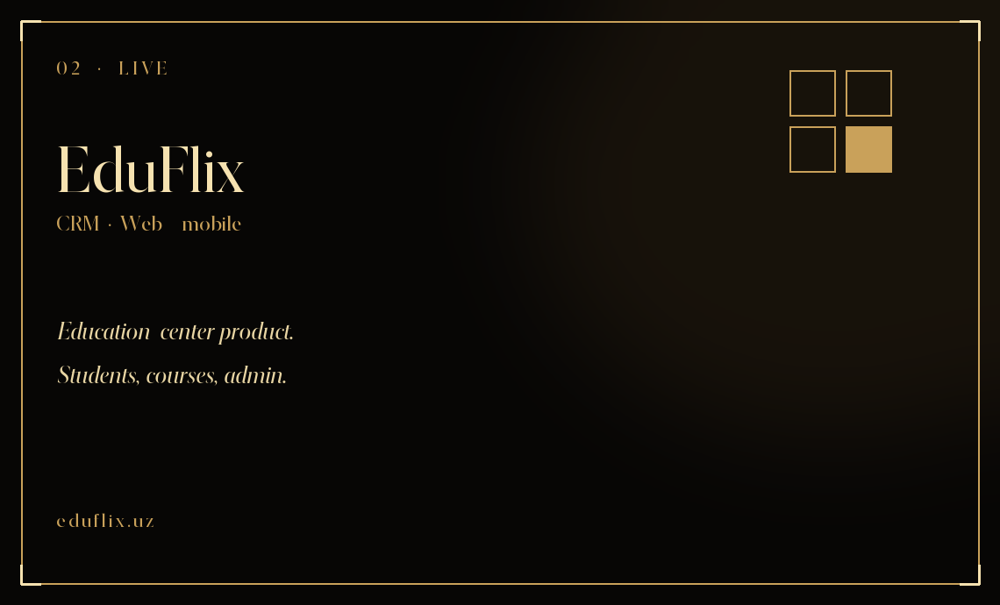
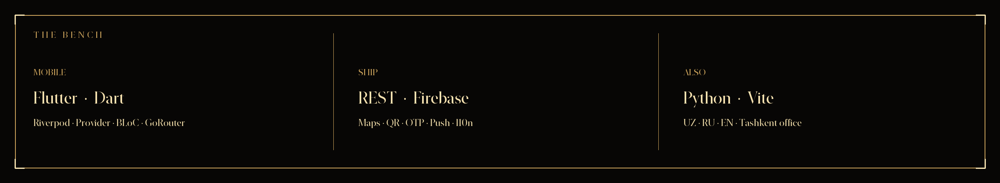

  

  <a href="https://play.google.com/store/apps/details?id=uz.hazina.app">Hazina</a>
  &nbsp;·&nbsp;
  <a href="https://github.com/Thedarik/hazina">write-up</a>
  &nbsp;·&nbsp;
  <a href="https://eduflix.uz">EduFlix</a>
  &nbsp;·&nbsp;
  <a href="https://uznext.uz">UzNext</a>
  &nbsp;·&nbsp;
  <a href="https://t.me/thedarik">Telegram</a>
  &nbsp;·&nbsp;
  <a href="https://www.linkedin.com/in/samandar-eshpulatov-5175802b6/">LinkedIn</a>

  

---

  
  
  

  <a href="https://play.google.com/store/apps/details?id=uz.hazina.app">Play Market</a>
  ·
  <a href="https://github.com/Thedarik/hazina">Hazina repo</a>
  ·
  <a href="https://eduflix.uz">eduflix.uz</a>
  ·
  <a href="https://github.com/Thedarik/edu_front">edu_front</a>
  ·
  <a href="https://uznext.uz">uznext.uz</a>

---

  

**Public Flutter a recruiter can clone**

- [upgrade](https://github.com/Thedarik/upgrade) — education app UI: videos, tests, levels, ranking
- [word](https://github.com/Thedarik/word) — language-assessment learning app

Hazina source stays private (`hazina_app`) — store keys. The pass above is what to open first.

Looking for a Flutter / mobile role in Tashkent (office or hybrid).

  

  <a href="https://t.me/thedarik">Telegram</a>
  ·
  <a href="https://www.linkedin.com/in/samandar-eshpulatov-5175802b6/">LinkedIn</a>
  ·
  <a href="https://www.upwork.com/freelancers/~0189c72f70e6b68f66">Upwork</a>

