<div align="center">

# 🚀 Transforming Ideas Into Powerful Mobile Experiences


</div>

---

<div align="center">

### 💼 **Available for Freelance Projects | Open to Full-Time Opportunities**

[](https://www.linkedin.com/in/samandar-eshpulatov-5175802b6/)
[](https://www.upwork.com/freelancers/~0189c72f70e6b68f66)
[](https://t.me/thedarik)

[](https://github.com/Thedarik?tab=followers)
[](https://github.com/Thedarik?tab=repositories)


</div>

---

## 🎯 Why Choose Me?

<table>
<tr>
<td width="33%" align="center">


### ⚡ Fast Delivery
**48-hour turnaround** on urgent tasks. I respect deadlines and deliver quality on time, every time.
</td>
<td width="33%" align="center">


### 🏆 Production-Ready Code
**Clean, maintainable, scalable.** Code that your team will thank you for. Following industry best practices and SOLID principles.
</td>
<td width="33%" align="center">


### 💬 Clear Communication
**Daily updates, transparent process.** You'll always know exactly where your project stands.
</td>
</tr>
</table>

---

## 🔥 What I Can Do For You

<div align="center">

| 🎨 **Beautiful UI/UX** | 🏗️ **Solid Architecture** | ⚡ **Performance** | 🔐 **Security** |
|:---:|:---:|:---:|:---:|
| Pixel-perfect designs that wow users | Clean Architecture that scales | Lightning-fast, optimized apps | Secure authentication & data |
| Custom animations | MVVM, Repository patterns | 60 FPS smooth experience | Best security practices |
| Responsive layouts | Modular, testable code | Efficient state management | Encrypted data handling |

</div>

---

## 💡 My Expertise

<table>
<tr>
<td width="50%">

### 🛠️ **Technical Arsenal**

```dart
final mySkills = {
  'mobile': ['Flutter', 'Dart', 'iOS', 'Android'],
  'stateManagement': ['Riverpod ⭐', 'Provider', 'Bloc', 'GetX'],
  'backend': ['Firebase 🔥', 'Supabase', 'REST API', 'GraphQL'],
  'architecture': ['Clean Architecture', 'MVVM', 'Repository'],
  'tools': ['Git', 'Figma', 'Postman', 'CI/CD'],
  'testing': ['Unit Tests', 'Widget Tests', 'Integration Tests'],
};

// ⭐ = My favorite and most proficient
```

**📊 Experience Level:**
- 🟢 **Expert:** Flutter, Dart, Firebase, Riverpod
- 🟢 **Advanced:** Clean Architecture, REST APIs, UI/UX
- 🟡 **Intermediate:** GraphQL, Native Development

</td>
<td width="50%">

### 🎯 **What I Deliver**

✅ **E-Commerce Apps**
- Shopping cart & checkout
- Payment gateway integration
- Order tracking systems
- Product catalogs with filters

✅ **Social Media Apps**
- Real-time messaging
- Feed & stories
- User profiles & authentication
- Push notifications

✅ **Business Apps**
- CRM systems
- Inventory management
- Analytics dashboards
- Multi-user role systems

✅ **On-Demand Services**
- Location tracking
- Booking systems
- Rating & reviews
- Real-time updates

</td>
</tr>
</table>

---

## 🚀 Featured Success Stories

<div align="center">

### 🛒 **E-Commerce Platform** | *Client Satisfaction: 100%*


**🎯 Challenge:** Build a scalable e-commerce app from scratch in 6 weeks

**💡 Solution:** 
- Implemented Clean Architecture for maintainability
- Integrated Stripe payment gateway
- Built custom cart system with real-time sync
- Created admin panel for inventory management

**📈 Results:**
- ⭐ **5,000+ downloads** in first month
- ⚡ **99.9% crash-free** rate
- 🚀 **4.8/5** App Store rating
- 💰 Client gained **$50K+ revenue** in 3 months

[](https://github.com/Thedarik/ecommerce-app-flutter)

---

### 🍕 **Food Delivery App** | *Featured on Product Hunt*


**🎯 Challenge:** Create real-time food ordering platform with live tracking

**💡 Solution:**
- Real-time order tracking with Google Maps
- Push notifications for order updates
- Multi-restaurant management system
- Driver assignment algorithm

**📈 Results:**
- 🎉 **10,000+ active users**
- ⚡ **3-minute average** order time
- 🌟 **4.7/5** user rating
- 📱 Successfully launched on **both iOS & Android**

[](https://github.com/Thedarik/food-delivery-app)

</div>

---

## 📊 By The Numbers

<div align="center">

<table>
<tr>
<td align="center" width="25%">


### 3.5+
**Years of Experience**
</td>
<td align="center" width="25%">


### 20+
**Projects Completed**
</td>
<td align="center" width="25%">


### 100%
**Client Satisfaction**
</td>
<td align="center" width="25%">


### 50K+
**Lines of Clean Code**
</td>
</tr>
</table>

</div>

---

## 🎓 My Development Process

```mermaid
graph LR
    A[📋 Requirements] -->|Understanding| B[🎨 Design]
    B -->|Planning| C[💻 Development]
    C -->|Quality Check| D[🧪 Testing]
    D -->|Polish| E[🚀 Deployment]
    E -->|Iterate| F[📈 Maintenance]
    F -.->|Feedback| A
    
    style A fill:#00D9FF,stroke:#0099CC,stroke-width:2px,color:#000
    style B fill:#FF6B6B,stroke:#CC5555,stroke-width:2px,color:#000
    style C fill:#4ECDC4,stroke:#3BA39C,stroke-width:2px,color:#000
    style D fill:#FFE66D,stroke:#CCBA57,stroke-width:2px,color:#000
    style E fill:#95E1D3,stroke:#75B3A9,stroke-width:2px,color:#000
    style F fill:#C7CEEA,stroke:#9FA6BB,stroke-width:2px,color:#000
```

<div align="center">



### ✨ **I Don't Just Code - I Partner With You**

</div>

1. **🎯 Discovery Call** - Understanding your vision and requirements
2. **📝 Detailed Proposal** - Clear timeline, milestones, and deliverables
3. **🎨 Design & Architecture** - Planning for scale and maintainability
4. **💻 Agile Development** - Bi-weekly demos, constant feedback
5. **🧪 Rigorous Testing** - Unit, widget, and integration tests
6. **🚀 Deployment & Launch** - App store submission and monitoring
7. **📈 Post-Launch Support** - Bug fixes, updates, and improvements

---

## 💼 Services I Offer

<table>
<tr>
<td width="50%">

### 🆕 **New App Development**
- 📱 Complete app from scratch
- 🎨 UI/UX implementation from designs
- 🏗️ Architecture planning
- 📦 App store deployment
- 💰 **Starting from $3,000**

### 🔧 **App Maintenance & Updates**
- 🐛 Bug fixes
- ⚡ Performance optimization
- 🆙 Feature additions
- 📱 OS compatibility updates
- 💰 **$50/hour**

</td>
<td width="50%">

### 🔄 **Code Refactoring**
- 🧹 Legacy code cleanup
- 🏗️ Architecture improvement
- 📈 Performance optimization
- 🧪 Adding tests
- 💰 **$60/hour**

### 👨‍🏫 **Consulting & Mentoring**
- 🎓 Flutter best practices
- 🏗️ Architecture review
- 👥 Team training
- 📊 Code review
- 💰 **$80/hour**

</td>
</tr>
</table>

---

## 🏆 Achievements & Recognition

<div align="center">

🌟 **Top Rated on Upwork** | 💼 **20+ Successful Projects** | ⭐ **100% Client Satisfaction**

📦 **5+ Open Source Packages** | 🎓 **Mentor to 10+ Developers** | 💬 **Active on Stack Overflow**


</div>

---

## 📈 GitHub Performance

<div align="center">
  
  
</div>

<div align="center">
  
</div>

---

## 💬 What Clients Say

<table>
<tr>
<td width="33%" align="center">

### ⭐⭐⭐⭐⭐

*"Samandar delivered our e-commerce app ahead of schedule. The code quality is exceptional, and he was always available for questions. Highly recommend!"*

**- Michael R., USA**
CEO, TechStart

</td>
<td width="33%" align="center">

### ⭐⭐⭐⭐⭐

*"Best Flutter developer I've worked with. Clean code, great communication, and delivered exactly what we needed. Will hire again!"*

**- Sarah L., UK**
Product Manager

</td>
<td width="33%" align="center">

### ⭐⭐⭐⭐⭐

*"Professional, skilled, and reliable. Samandar transformed our app's architecture and improved performance by 40%. Amazing work!"*

**- Ahmed K., UAE**
Startup Founder

</td>
</tr>
</table>

---

## 🚀 Ready To Start Your Project?

<div align="center">

### 🎯 **Let's Turn Your Idea Into Reality!**


### 📞 **Get In Touch**

<table>
<tr>
<td align="center">
<a href="https://www.upwork.com/freelancers/~0189c72f70e6b68f66">

</a>
</td>
<td align="center">
<a href="https://t.me/thedarik">

</a>
</td>
<td align="center">
<a href="https://www.linkedin.com/in/samandar-eshpulatov-5175802b6/">

</a>
</td>
</tr>
</table>

### ⚡ **Response Time: Within 24 Hours**

---


<sub>💡 **Fun Fact:** I drink ☕ coffee while debugging and 🍵 tea while architecting. My code is tested, my commits are meaningful, and my apps are loved by users.</sub>

**⭐ If you find my work interesting, consider starring my repositories!**

</div>
